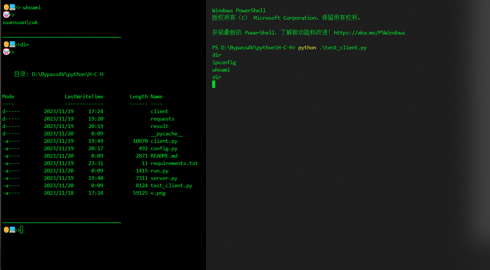

# Pboot_C2_Concept_edition

## 声明

__！！！__  
__禁止恶意攻击，__  
__本项目单纯以学习为目的，__  
__使用前请详细阅读网络安全法，__  
__出现任何非法攻击，由使用者自行承担。__   
__！！！__

## 项目说明
本项目目前为`概念版`，也就是`学习版`，请勿使用在实战中，很多缺点....   

这个项目是以`Pbootcms`为中介(媒介)进行`c2`操作，在某些环境中起到关键作用，例如`白名单`。  

这里只是以`Pbootcms`为例子，实战中请`学会变通`，并不是代表只能使用Pbootcms，这里是以`图片传递消息`，`实用性`，`扩展性`得到提升，但是需要根据实际情况进行更改，例如`上传图片`，网站进行了`压缩，添加水印，裁剪`等等，这时就要根据实际情况更改传输方式，例如`网站评论，私信，个人信息更改`等等地方，进行操作。  

本项目的`服务端`以及`客户端`代码都是以`python`代码编写，在打包为exe上很大缺陷，`文件大`，`特征性强`，持`久性免杀`存在问题。这里如果对其他语言熟悉的话，可以对`client.py` OR `test_client.py`进行重构，例如`GO,C++`，后续有时间也会更新项目，将`client`部分代码用其他语言进行重构。  

在`client.py`代码中写了一些`类似插件`的代码,如`shellcode加载，dll加载，上传文件，下载文件`,当然这样写可能是有问题的，所以目前该项目为`概念版`，单纯做了个`简单的框架`，后续会`进行重写`。  

## 项目使用

### pip安装
```bash
pip install -r requirements.txt -i https://pypi.tuna.tsinghua.edu.cn/simple/
```
如果缺失第三方包，请自行pip安装

### 服务端config.py配置
```
# ip或者域名,需要对应上
domian=[
    {"IP":"http://127.0.0.1:88",
     "PHPSESSID":"2mj9qepq0bntlrh6j6lb2cq529",
     "passwd":"admin"
     }
]

# 加密密钥
key="suanpro"

# 时间延迟
slepp=0

# 证书验证
https=False
```
`domian` 只需要在列表内添加一个跟示例里的字典即可  

`IP` 代表cms服务器的主域   

`PHPSESSID` 代表cms内`cookie`里面`PbootSystem`的值

`passwd` 为登录cms的`密码`,`Pbootcms`支持用户注册，如若关闭了注册功能，换一个就好。  

`key` 代表进行xor操作的密钥，随便更改。 

`slepp` 暂时不用管，该功能还没有添加  

`https` 暂时不用管，该功能还没有添加  

__如果设置了多个domain：__  
这里本来是想弄成`msf`一样，但是没有时间，所以就搁置了  
在`run.py`的第七行中`demo = ip_list[0]`,使用那个就改这个`0`就行，`0`表示第一个，`1`表示第二个

### 客户端配置
在`test_client.py或者client.py`的最下面一行代码
```python
suansuan("http://127.0.0.1:81","4alq0oq5tup61soak268civ9ae","suanpro","admin")
```
分别代表 IP，PHPSESSID，key，passwd  
这几个参数不懂，看上面说明  

### 启动服务端
```bash
python run.py
```

### 启动服务端

随便哪个都行  
```bash
python client.py
```

```bash
python test_client.py
```

### 注意事项

如果使用途中，`Pbootcms`自动退出登录，可以使用`火狐，配一个burp代理`访问该网站，这样就不会自动退出，导致运行失败。

### 使用示例  
这里是随机互联网找的一个安装了`Pbootcms`的服务器  




### 最后

代码都写了很详细的注释，感兴趣的可以接着写，但是建议使用其他语言写。  

单纯学习的话够了。